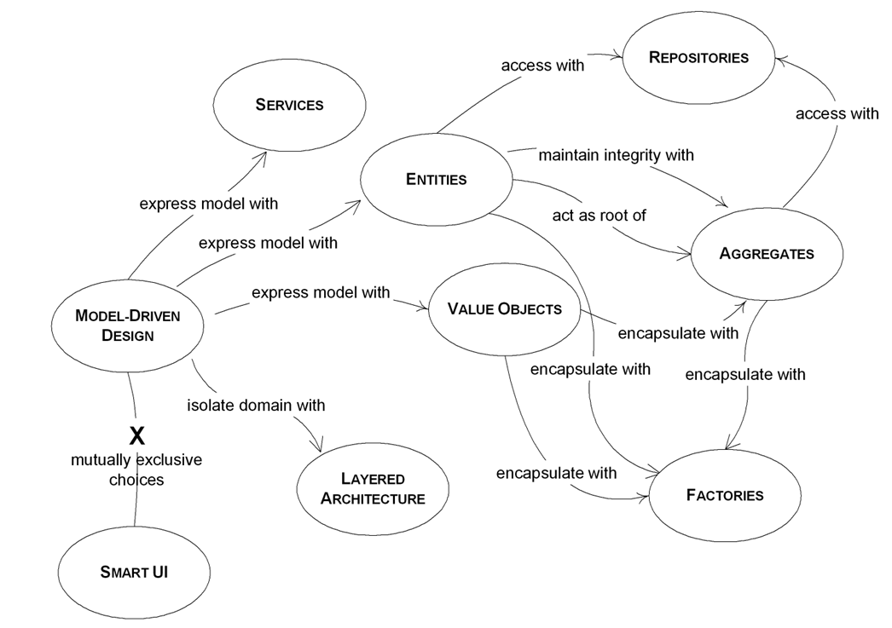

Domain-Driven Design is focused on creating high-quality software that not only meet the users needs, but also is designed
to deliver true business value. Software that is not merely working but has the potential to accompany the business
strategic initiatives and provide a clear competitive advantage. Software that can be evolved throughout the years to
remain a valuable asset instead of being a recurring cost.

It does so by addressing both the strategic needs of the business and the tactical ways of translating them into real
software that works. This guide doesn't even try to address the strategic side of DDD but is focused on the common
mistakes and their solution your can face when implementing DDD in your project. Examples of such mistakes and their
solution are presented, based on the SeedStack business framework.

# Contents of this guide

This guide is mainly intended for beginners that should know about these pitfalls in order to recognize and avoid them
before it's too late. But it can also be of valuable help to more seasoned developers.

The following topics are addressed:

* The Anemic Domain Model [Fowler, Anemic], is viewed by many as an anti-pattern of Domain Modeling and will prevent you
to get all the benefits from Domain-Driven Design. We will look at its disadvantages and how to recognize it. An example
will show how to refactor an Anemic Domain Model into a Rich Domain Model.
* The duality of Entities and Value Objects will be explored. What are their respective characteristics, when to use which,
and how to manage identities.
* Aggregate design is a particularly difficult topic, especially for beginners. We will review various criteria which
can help in achieving the right granularity and (de)coupling level.
* In relation to the Anemic Domain Model topic, we will focus on the behavior of the domain. When behavior should go
into Entities/VO or segregated into Services, what are the characteristics of a good service.
* Beyond the Domain, live its clients like the Application layer. We will look at how they can effectively use the domain
while being kept thin.

# Tactical patterns

As a reference, the main DDD tactical patterns and their relations are summarized on the following diagram: 

 
# References

* [Fowler, Anemic] Fowler Martin. 2003. [http://www.martinfowler.com/bliki/AnemicDomainModel.html](http://www.martinfowler.com/bliki/AnemicDomainModel.html).
 